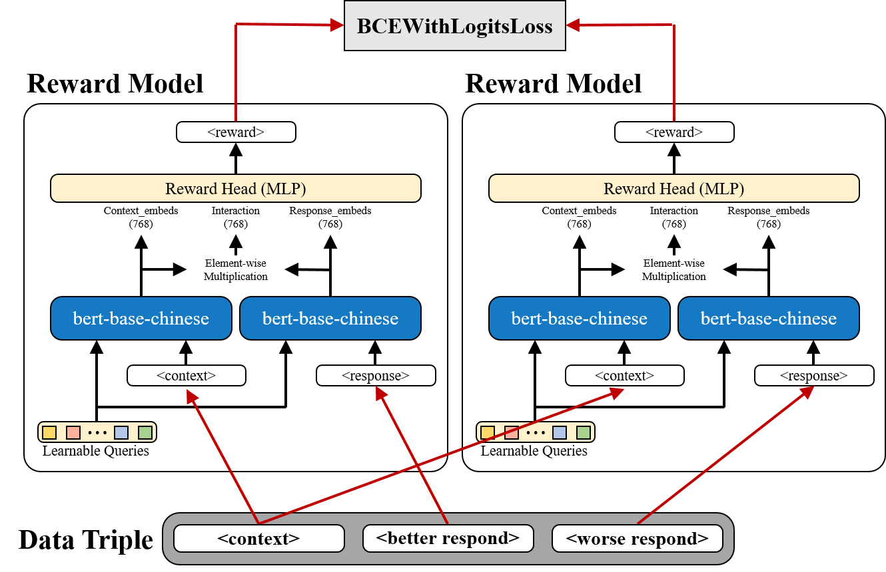
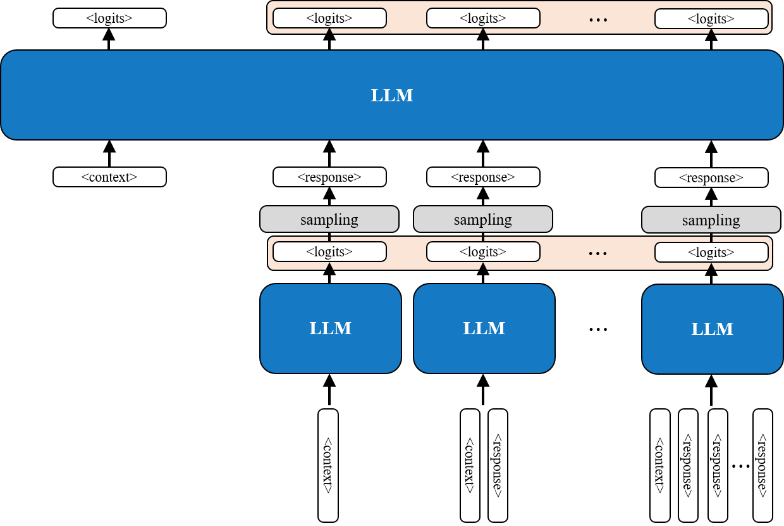
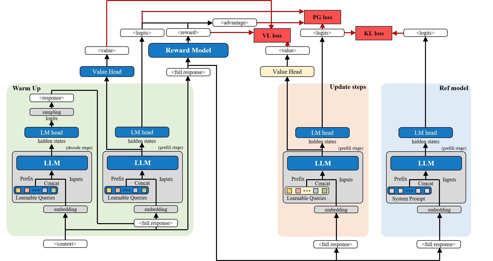
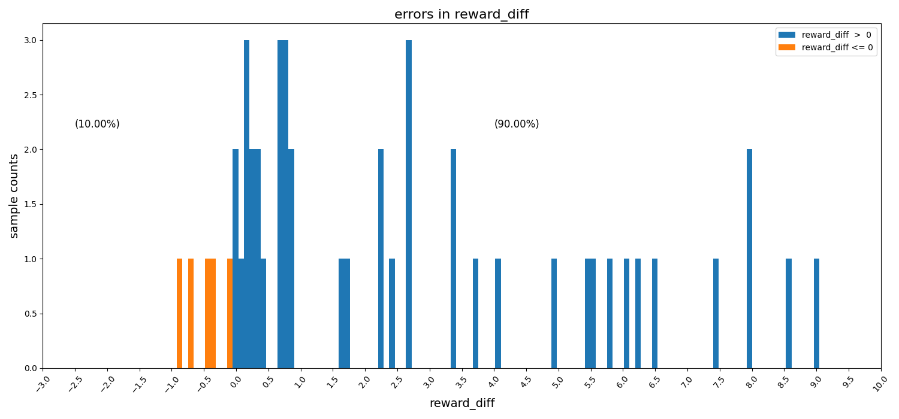
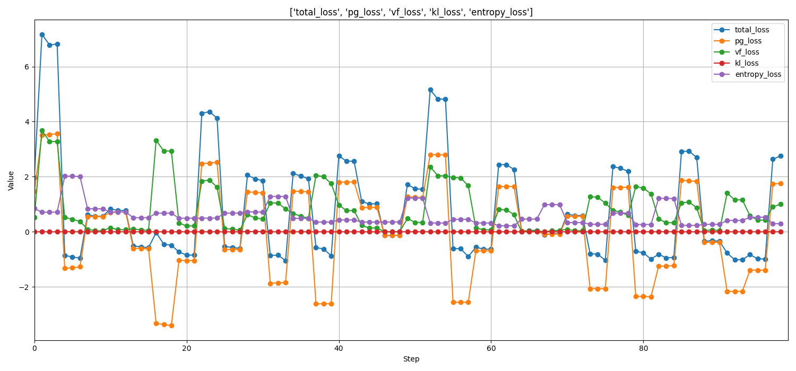
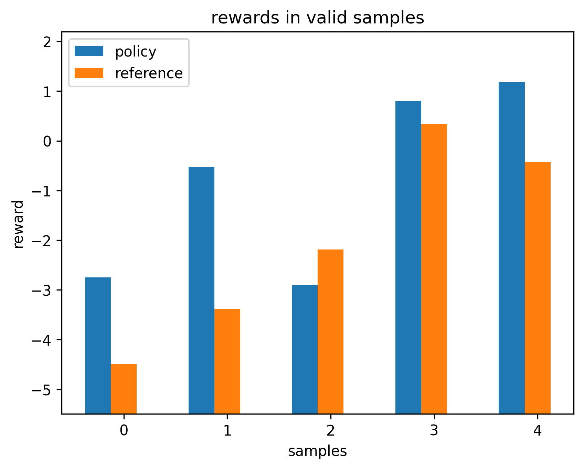
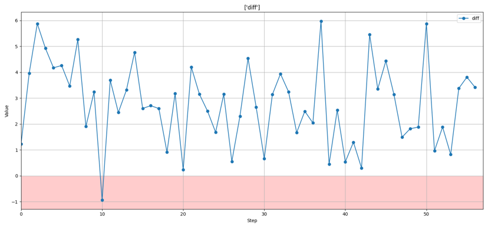

PREFERENCE OPTIMIZATION · PREFIX TUNING

# Hard Prompt to Soft Prompt

Preference-optimized prompt adaptation with a frozen language model

Convert a human-written instruction into a learnable soft prefix, then optimize only those embeddings with preference feedback and response-level PPO. 

[Explore the method](#method){ .md-button .md-button--primary }
[View the results](#results){ .md-button }

  

    <strong>500</strong>
    preference pairs
  

  

    <strong>90.00%</strong>
    reward-model validation accuracy
  

  

    <strong>245</strong>
    policy-training conversations
  

  

    <strong>Frozen</strong>
    base language model
  

## Overview

Hand-crafted system prompts provide a useful behavioral baseline for large language models, but their responses can still differ from the preferences of users or domain experts. This project explores a parameter-efficient alternative to full-model fine-tuning: **initialize a trainable soft prefix from an existing hard prompt, then optimize only that prefix with preference feedback**.

The target application was conversational data collection for assessments involving people potentially affected by Alzheimer's disease. The model was designed to imitate a human tester: maintain the conversation, ask appropriate follow-up questions, and encourage the participant to provide more speech data. Disease analysis and diagnosis were outside the project scope.

  Hard prompt
  <b aria-hidden="true">→</b>
  Token embeddings
  <b aria-hidden="true">→</b>
  Learnable soft prefix
  <b aria-hidden="true">→</b>
  Preference optimization

> The original prompt supplies a semantically meaningful initialization instead of starting the soft-prompt parameters at random.

## Method

### 1. Preference data and reward model

The original data consisted of Traditional Chinese conversations between real testers and participants during assessment sessions. Conversation contexts were randomly truncated, and `google/gemma-3-1b-it` generated two candidate responses for each context. A real tester compared each pair using four labels:

- A is better than B
- B is better than A
- Both are poor
- Both are good

The last two categories were discarded because they provide no directional preference signal. The resulting dataset contained **500 context–better–worse pairs**.

The reward model used `bert-base-chinese`. Its BERT backbone was frozen, while a **20-token learnable prefix**, context/response projection layers, and an MLP reward head were trained. For context $c$ and response $y$, the model predicts a scalar reward $r(c,y)$ and learns the ordering

$$
r(c,y_{\mathrm{better}}) > r(c,y_{\mathrm{worse}}).
$$

Equivalently, the pairwise objective minimizes

$$
\mathcal{L}_{\mathrm{RM}}
= -\log \sigma\!\left(r(c,y_{\mathrm{better}})-r(c,y_{\mathrm{worse}})\right).
$$

<figure class="research-figure research-figure--diagram">
  
  <figcaption><strong>Figure 1.</strong> Pairwise reward-model training. The same scoring model evaluates the preferred and non-preferred responses; their reward difference is optimized with <code>BCEWithLogitsLoss</code>.</figcaption>
</figure>

The dataset was randomly split into **80% training and 20% validation**.

### 2. Hard prompt to soft prompt

The policy model used `google/gemma-3-1b-it`. Rather than initializing prefix parameters randomly, the original tester system prompt was tokenized and its token embeddings were copied directly into trainable prefix embeddings.

The entire Gemma model remained frozen; **only the soft-prefix embeddings were updated**. This retains the semantics of an already functional prompt while permitting continuous optimization in embedding space.

### 3. Single-step PPO

Policy optimization used **245 historical human assessment conversations**. Conversations were randomly truncated to create training contexts and split using a **98%/2% train–validation ratio**.

An entire generated response is treated as one action or decision step, rather than treating every generated token as a separate reinforcement-learning step. This is referred to as **Single-Step PPO**.

<figure class="research-figure research-figure--compact">
  
  <figcaption><strong>Figure 2.</strong> Decode, then prefill. A complete response is first sampled autoregressively; the context–response sequence is then forwarded again to collect the logits used by the optimization objective.</figcaption>
</figure>

For each context:

1. The soft-prefix policy generates a complete response.
2. The reward model assigns a scalar reward.
3. A value head estimates the expected reward.
4. The reward and value estimate produce the advantage.
5. A clipped PPO policy-gradient objective updates the soft prefix.

The optimization also included value loss and entropy regularization. A reference policy used the same frozen Gemma model with the **original hard prompt**, providing a baseline for comparison.

A KL-divergence constraint between policy and reference distributions was designed as a stability mechanism. Due to implementation and training-stability issues, however, **KL regularization was disabled in the reported experiment**.

<figure class="research-figure research-figure--diagram">
  
  <figcaption><strong>Figure 3.</strong> Single-Step PPO training architecture. The diagram includes the intended optional KL branch; the reported experiment used the policy-gradient, value, and entropy objectives with the KL term disabled.</figcaption>
</figure>

## Results

### Reward model

  Validation pairwise ranking accuracy
  <strong>90.00%</strong>

On the single 80/20 train–validation split, the learned reward function reasonably distinguished tester-preferred responses from less-preferred alternatives within the collected dataset.

<figure class="research-figure research-figure--plot">
  
  <figcaption><strong>Figure 4.</strong> Validation distribution of the better-minus-worse reward difference. Positive differences represent correct pairwise rankings; 90% of validation pairs fall in this region.</figcaption>
</figure>

### Soft-prompt policy

The PPO policy-gradient, value, and entropy objectives remained trainable throughout optimization, although the loss curves oscillated substantially. PPO loss was therefore **not interpreted as evidence of behavioral convergence**.

<figure class="research-figure research-figure--plot">
  
  <figcaption><strong>Figure 5.</strong> Recorded policy-training objectives. Their pronounced oscillation motivates avoiding a convergence claim based on PPO loss alone; the KL trace remains zero because regularization was disabled.</figcaption>
</figure>

The held-out policy validation subset contained only **5 conversations**:

- The optimized soft-prefix policy received a higher reward-model score in **4 cases**.
- The original hard-prompt reference received a higher score in **1 case**.

<figure class="research-figure research-figure--plot research-figure--compact">
  
  <figcaption><strong>Figure 6.</strong> Per-sample surrogate rewards on the five held-out conversations. The optimized policy scores higher in four samples, while the reference scores higher in one.</figcaption>
</figure>

During training, the policy–reference reward difference was positive for most recorded steps. This suggests that PPO moved the prefix toward behaviors favored by the learned reward model.

<figure class="research-figure research-figure--plot">
  
  <figcaption><strong>Figure 7.</strong> Policy-minus-reference reward over recorded training steps. Nearly all differences are positive, although this remains an evaluation against the same learned reward model used for optimization.</figcaption>
</figure>

## Discussion

The central observation is that a human-written prompt can serve not only as an inference-time instruction, but also as a **semantic initialization for continuous prompt optimization**. The method searches a small parameter space consisting only of prompt embeddings rather than optimizing billions of LLM parameters. It is therefore well suited to tasks where prompting already provides a strong baseline and only moderate behavioral adaptation is needed.

The findings remain preliminary for three reasons:

1. The reward model used only 500 comparisons. Its 90.00% accuracy came from one random validation split without an independent test set or repeated runs.
2. The PPO validation subset contained only five samples, which is too small for reliable statistical conclusions.
3. The **same reward model served as both the PPO training signal and the comparison metric**. Improved surrogate rewards do not independently establish that human testers would prefer the resulting responses.

Potential reward over-optimization therefore cannot be excluded. A stronger evaluation requires independent, blinded human comparison between responses from the original hard prompt and the optimized soft prompt.

## Conclusion

This project demonstrates a parameter-efficient path from a human-written prompt to a preference-optimized soft prefix while keeping the underlying language model frozen. The reward model achieved **90.00% validation ranking accuracy**, and the optimized policy generally received higher surrogate rewards than the hard-prompt reference in the small validation experiment.

The result provides preliminary evidence that **semantically initialized soft prompts can be optimized toward learned human preferences without modifying the base LLM**, while underscoring the need for larger-scale and independent human evaluation.
